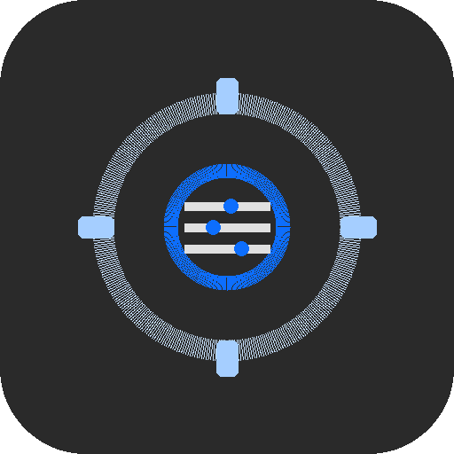

<p align="center">
  
</p>

<h1 align="center">Control Menu</h1>

<p align="center">
  A web-based tool for managing Android devices, CCTV cameras, Jellyfin media server, and system utilities from one place.
</p>

<p align="center">
  
  
  
</p>

---

## What It Does

Control Menu replaces a collection of PowerShell scripts with a cross-platform web UI. It manages:

- **Android Devices** &mdash; Connect, reboot, toggle power/screensaver, manage ADB settings, and screen mirror Google TVs and Android phones via [ws-scrcpy-web](https://github.com/ANG-DEVELOPERS/ws-scrcpy-web)
- **Cameras** &mdash; View LTS/Hikvision CCTV cameras via [go2rtc](https://github.com/AlexxIT/go2rtc) RTSP-to-browser streaming. Configurable camera count with encrypted credential storage. go2rtc is auto-installed and updated via the dependency manager.
- **Jellyfin Media Server** &mdash; Database date updates, cast & crew image refresh (background worker with resume support), Docker container management, automated backups with configurable retention
- **Utilities** &mdash; Image-to-ICO icon conversion (PNG, JPG, BMP, GIF, WEBP, TIFF via SkiaSharp) with native file picker, Windows Zone.Identifier file unblocker
- **Dependency Management** &mdash; Auto-installs and updates ADB, scrcpy, Node.js, sqlite3, and go2rtc to a self-contained `dependencies/` folder. Configurable install paths per tool. Version checks via GitHub API and direct URL scraping. Services are automatically stopped before binary updates and restarted after.

## Features

- **Modular architecture** &mdash; `IToolModule` interface with auto-discovery via reflection
- **First-run wizard** &mdash; 7 steps: Welcome, Android Devices, Cameras, Jellyfin, Email, Dependencies, Done
- **Dark/light theme** &mdash; OAO grey palette with two-state toggle
- **Cross-platform** &mdash; `CommandExecutor` strategy pattern abstracts Windows vs Linux commands
- **Encrypted secrets** &mdash; ASP.NET Data Protection API for API keys and passwords
- **Background jobs** &mdash; Long-running tasks with progress tracking, cancellation, and resume
- **Self-contained dependencies** &mdash; Bundled tools folder with PATH injection at startup; install/update buttons in UI; services auto-stop/restart during updates
- **Email notifications** &mdash; Configurable SMTP with dedicated From address for provider authorization
- **File System Access API** &mdash; Native OS file picker for icon conversion in Chrome/Edge

## Quick Start

### Prerequisites

- [.NET 9 SDK](https://dotnet.microsoft.com/download/dotnet/9.0)
- [Node.js](https://nodejs.org/) (for ws-scrcpy-web screen mirroring, optional &mdash; auto-installable)
- [ADB / Platform Tools](https://developer.android.com/tools/releases/platform-tools) (optional &mdash; auto-installable)
- [Docker](https://docs.docker.com/get-docker/) (for Jellyfin management)

### Run

```bash
cd src/ControlMenu
dotnet run
```

Open http://localhost:5159 in your browser. The first-run wizard will guide you through setup.

### Test

```bash
dotnet test
```

143+ tests covering services, modules, and integrations.

## Architecture

```
src/ControlMenu/
  Components/           # Blazor pages and layouts
    Layout/             #   MainLayout, Sidebar, TopBar
    Pages/              #   Home, Settings, Setup Wizard
    Shared/             #   ScrcpyMirror component
  Data/                 # EF Core entities, enums, migrations
  Modules/              # Pluggable tool modules
    AndroidDevices/     #   ADB service, Google TV & Android Phone dashboards
    Cameras/            #   CCTV camera streaming via go2rtc
    Jellyfin/           #   Docker ops, DB updates, Cast/Crew worker
    Utilities/          #   Icon converter, File unblocker
  Services/             # Core services (config, secrets, jobs, dependencies, email)
  wwwroot/              # Static assets, CSS, theme, JS interop
tests/ControlMenu.Tests/
```

### Key Design Decisions

| Decision | Rationale |
|----------|-----------|
| Blazor Server (not WASM) | Needs direct access to ADB, Docker, filesystem |
| `IDbContextFactory` | Prevents stale EF change tracker in long-lived Blazor circuits |
| `IServiceScopeFactory` for background work | Workers outlive the Blazor circuit that started them |
| SQLite | Single-file DB, no external database server needed |
| SkiaSharp for images | Cross-platform replacement for System.Drawing.Common |
| ws-scrcpy-web via iframe | Screen mirroring without native scrcpy binary dependency |
| File System Access API | Native OS file dialogs for icon converter (Chrome/Edge) |
| Self-contained dependencies | 5 auto-managed tools in `dependencies/`; 2 external (Docker, ws-scrcpy-web) |

## Dependencies

Control Menu manages two types of dependencies:

**Auto-installable** (downloaded to `dependencies/` folder):
| Tool | Source | Purpose |
|------|--------|---------|
| ADB | Google (DirectUrl) | Android device management |
| scrcpy | GitHub (Genymobile/scrcpy) | Screen mirroring server binary |
| Node.js | nodejs.org (DirectUrl) | ws-scrcpy-web runtime |
| sqlite3 | sqlite.org (DirectUrl) | Jellyfin database operations |
| go2rtc | GitHub (AlexxIT/go2rtc) | RTSP-to-browser camera streaming |

**External** (installed separately):
| Tool | Purpose |
|------|---------|
| Docker | Jellyfin container management |
| ws-scrcpy-web | Browser-based screen mirroring |

Install paths are configurable per-tool in Settings > Dependencies.

## Module System

Modules implement `IToolModule` and are discovered at startup:

```csharp
public interface IToolModule
{
    string Id { get; }
    string DisplayName { get; }
    string Icon { get; }
    int SortOrder { get; }
    IEnumerable<ModuleDependency> Dependencies { get; }
    IEnumerable<ConfigRequirement> ConfigRequirements { get; }
    IEnumerable<NavEntry> GetNavEntries();
    IEnumerable<BackgroundJobDefinition> GetBackgroundJobs();
}
```

Modules must have parameterless constructors for auto-discovery.

## License

Private project.
